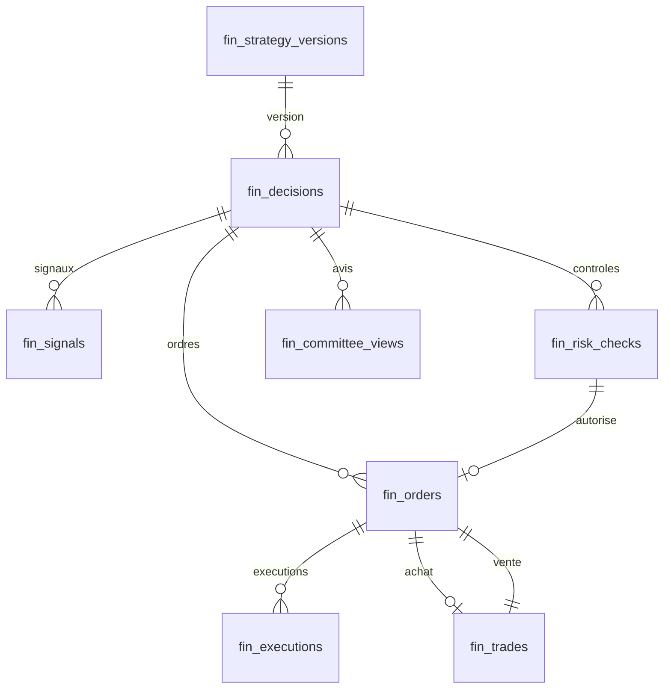

# Socle de données de TrendGuard (journal financier)

Tiré de `trendguard/donnees.py` (`python -m trendguard.donnees catalogue` le réécrit) ; un test vérifie que ce document et le schéma restent identiques.

## `fin_schema_migrations`

Version du schéma : migrations appliquées et leur empreinte.

| Rubrique | |
| --- | --- |
| Propriétaire | `trendguard/donnees.py` (domaine « fin_ ») |
| Lue par | ce module au démarrage |
| Écrite par | ce module (migrate, rollback) |
| Contrat | migrations numérotées |
| Durée de vie | toujours |
| Index | clé primaire seulement |

| Colonne | Type | Obligatoire | Clé |
| --- | --- | --- | --- |
| `version` | INTEGER | oui | primaire |
| `name` | TEXT | oui |  |
| `checksum` | TEXT | oui |  |
| `applied_at` | TEXT | oui |  |

## `fin_strategy_versions`

Registre des versions de la stratégie (réglages en vigueur, version du code).

| Rubrique | |
| --- | --- |
| Propriétaire | `trendguard/donnees.py` (domaine « fin_ ») |
| Lue par | lignée, rapport |
| Écrite par | bot, à chaque décision (nouvelle version seulement) |
| Contrat | EvolutionChange.v1 |
| Durée de vie | toujours |
| Index | clé primaire seulement |

| Colonne | Type | Obligatoire | Clé |
| --- | --- | --- | --- |
| `id` | TEXT | oui | primaire |
| `params` | TEXT | oui |  |
| `code_version` | TEXT | oui |  |
| `first_seen` | TEXT | oui |  |

## `fin_decisions`

Décision du jour : marché, garde, mode sûr, arrêt d'urgence, qualité, source et date limite des données.

| Rubrique | |
| --- | --- |
| Propriétaire | `trendguard/donnees.py` (domaine « fin_ ») |
| Lue par | lignée, rapport, panneau |
| Écrite par | bot, une fois par jour |
| Contrat | DecisionRecord.v1, NoTradeGate.v1, KillSwitch.v1, MarketData.v1 |
| Durée de vie | toujours (une ligne par jour) |
| Index | clé primaire seulement |

| Colonne | Type | Obligatoire | Clé |
| --- | --- | --- | --- |
| `id` | TEXT | oui | primaire |
| `day` | TEXT | oui |  |
| `mode` | TEXT | oui |  |
| `strategy_version_id` | TEXT | oui |  |
| `bull` | INTEGER | oui |  |
| `regime` | TEXT | non |  |
| `equity` | REAL | oui |  |
| `halted` | INTEGER | oui |  |
| `safe_mode` | INTEGER | oui |  |
| `garde_blocked` | TEXT | oui |  |
| `data_quality` | REAL | non |  |
| `data_source` | TEXT | oui |  |
| `created_at` | TEXT | oui |  |
| `data_cutoff_at` | TEXT | non |  |

## `fin_signals`

Signaux du jour (achats signalés, ventes) et ce qu'il en est advenu.

| Rubrique | |
| --- | --- |
| Propriétaire | `trendguard/donnees.py` (domaine « fin_ ») |
| Lue par | lignée |
| Écrite par | bot, à la décision |
| Contrat | Signal.v1 |
| Durée de vie | toujours |
| Index | `fin_signals_decision` (par décision : lignée d'un trade) |

| Colonne | Type | Obligatoire | Clé |
| --- | --- | --- | --- |
| `id` | INTEGER | oui | primaire |
| `decision_id` | TEXT | oui |  |
| `asset` | TEXT | oui |  |
| `direction` | TEXT | oui |  |
| `close` | REAL | non |  |
| `breakout_level` | REAL | non |  |
| `momentum` | REAL | non |  |
| `volatility` | REAL | non |  |
| `outcome` | TEXT | oui |  |
| `detail` | TEXT | non |  |

## `fin_risk_checks`

Chaque contrôle de la porte d'exécution, approuvé ou refusé (jamais modifié).

| Rubrique | |
| --- | --- |
| Propriétaire | `trendguard/donnees.py` (domaine « fin_ ») |
| Lue par | lignée, rapport |
| Écrite par | bot (porte d'exécution), en ajout seulement |
| Contrat | RiskCheck.v1, ExecutionAuthorization.v1 |
| Durée de vie | toujours |
| Index | `fin_risk_checks_asset`, `fin_risk_checks_decision` (par décision ; par crypto et date pour l'historique) |

| Colonne | Type | Obligatoire | Clé |
| --- | --- | --- | --- |
| `id` | TEXT | oui | primaire |
| `decision_id` | TEXT | oui |  |
| `asset` | TEXT | oui |  |
| `status` | TEXT | oui |  |
| `qty` | REAL | oui |  |
| `expected_loss` | REAL | oui |  |
| `open_risk_pct` | REAL | oui |  |
| `exposure_pct` | REAL | oui |  |
| `checks` | TEXT | oui |  |
| `reasons` | TEXT | oui |  |
| `authorization_id` | TEXT | non |  |
| `policy_version` | TEXT | oui |  |
| `created_at` | TEXT | oui |  |

## `fin_orders`

Ordres d'achat (avec contrôle et autorisation) et de vente, clé d'unicité.

| Rubrique | |
| --- | --- |
| Propriétaire | `trendguard/donnees.py` (domaine « fin_ ») |
| Lue par | lignée, rapport |
| Écrite par | bot (exécution) |
| Contrat | OrderIntent.v1, Order.v1 |
| Durée de vie | toujours |
| Index | `fin_orders_asset`, `fin_orders_decision` (par décision ; par crypto, sens et état pour retrouver l'achat d'une position) |

| Colonne | Type | Obligatoire | Clé |
| --- | --- | --- | --- |
| `id` | TEXT | oui | primaire |
| `decision_id` | TEXT | non |  |
| `risk_check_id` | TEXT | non |  |
| `authorization_id` | TEXT | non |  |
| `idempotency_key` | TEXT | oui |  |
| `asset` | TEXT | oui |  |
| `side` | TEXT | oui |  |
| `qty` | REAL | oui |  |
| `price` | REAL | oui |  |
| `stop` | REAL | non |  |
| `mode` | TEXT | oui |  |
| `status` | TEXT | oui |  |
| `reason` | TEXT | non |  |
| `created_at` | TEXT | oui |  |

## `fin_executions`

Exécutions de chaque ordre : quantité, prix, frais (jamais modifiées).

| Rubrique | |
| --- | --- |
| Propriétaire | `trendguard/donnees.py` (domaine « fin_ ») |
| Lue par | lignée |
| Écrite par | bot (exécution), en ajout seulement |
| Contrat | Order.v1 |
| Durée de vie | toujours |
| Index | `fin_executions_order` (par ordre) |

| Colonne | Type | Obligatoire | Clé |
| --- | --- | --- | --- |
| `id` | TEXT | oui | primaire |
| `order_id` | TEXT | oui |  |
| `qty` | REAL | oui |  |
| `price` | REAL | oui |  |
| `fees` | REAL | oui |  |
| `executed_at` | TEXT | oui |  |

## `fin_trades`

Trades clos reliés à leur ordre d'achat et de vente, analyse après trade.

| Rubrique | |
| --- | --- |
| Propriétaire | `trendguard/donnees.py` (domaine « fin_ ») |
| Lue par | lignée, attribution, rapport |
| Écrite par | bot, à la vente |
| Contrat | TradeRecord.v1 |
| Durée de vie | toujours |
| Index | `fin_trades_closed`, `fin_trades_entry` (par ordre d'achat (lignée) ; par date de clôture (bilans)) |

| Colonne | Type | Obligatoire | Clé |
| --- | --- | --- | --- |
| `id` | TEXT | oui | primaire |
| `entry_order_id` | TEXT | non |  |
| `exit_order_id` | TEXT | oui |  |
| `asset` | TEXT | oui |  |
| `opened_at` | TEXT | non |  |
| `closed_at` | TEXT | oui |  |
| `entry` | REAL | non |  |
| `exit` | REAL | non |  |
| `pnl` | REAL | oui |  |
| `r` | REAL | non |  |
| `mfe_r` | REAL | non |  |
| `mae_r` | REAL | non |  |
| `slippage_pct` | REAL | non |  |
| `regime` | TEXT | non |  |
| `lesson` | TEXT | non |  |
| `reason` | TEXT | oui |  |

## `fin_committee_views`

Avis consultatif du comité d'agents sur chaque crypto proposée par la règle (jamais modifié), pour mesurer s'il aurait aidé.

| Rubrique | |
| --- | --- |
| Propriétaire | `trendguard/donnees.py` (domaine « fin_ ») |
| Lue par | rapport, diagnostic |
| Écrite par | bot, à la décision, en ajout seulement |
| Contrat | CommitteeView.v1 |
| Durée de vie | toujours |
| Index | `fin_committee_views_decision` (par décision : avis du jour) |

| Colonne | Type | Obligatoire | Clé |
| --- | --- | --- | --- |
| `id` | INTEGER | oui | primaire |
| `decision_id` | TEXT | oui |  |
| `asset` | TEXT | oui |  |
| `recommendation` | TEXT | oui |  |
| `consensus` | REAL | oui |  |
| `disagreement` | TEXT | oui |  |
| `reasons` | TEXT | oui |  |
| `votes` | TEXT | oui |  |
| `agents_version` | TEXT | oui |  |
| `created_at` | TEXT | oui |  |
